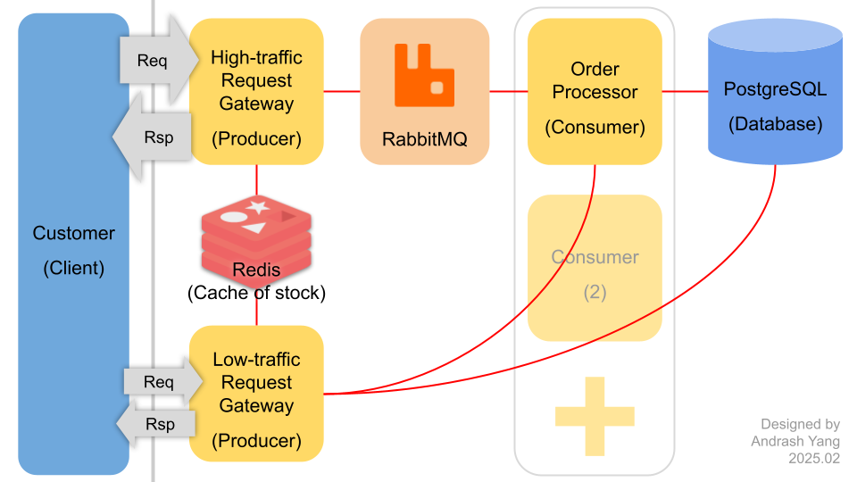

# 高併發限量搶購 API 示範系統



👆 在高併發限量搶購的應用上，建議可以採用這樣的架構。這次專案受限時間規模。僅在單一後端服務上嘗試實作部分架構。

本專案以 NestJS 框架為基礎，使用了 Redis、RabbitMQ、PostgreSQL 等技術以建構系統。使用 Drizzle ORM 存取資料庫，並使用 NestJS 的 [`ThrottlerModule`](src/app.module.ts) 實現 API 限流。

## 環境配置

### 系統

- 建議於 Ubuntu (我使用 24.04.1 LTS) 環境下運行本專案。若使用 Windows 建議安裝 WSL2 並在 WSL2 環境下以 Ubuntu 運行本專案。

### 依賴軟體

請先自行安裝設置以下軟體：

- Postgres (我使用 16.6)
  - 請確保它在運行狀態。可自訂帳密，其他使用預設設定即可。
- Redis (我使用 7.0.15)
  - 請確保它在運行狀態。使用預設設定即可。
- RabbitMQ (我使用 3.12.1)
  - 請確保它在運行狀態。使用預設設定即可。
- Node.js (我使用 22.14.0) 及 npm (我使用 10.9.2)
- Git
- (太忙了所以沒用 Docker)

## 安裝步驟

### 1. 下載專案

```bash
git clone https://github.com/cocoychris/high-concurrency-handling-demo.git
```

### 2. 安裝相依套件

```bash
cd high-concurrency-handling-demo
npm i
```

### 3. 設定環境變數

複製 `.env.example` 檔案並命名為 `.env`：

```bash
cp .env.example .env
```

然後依照需求修改裡面的設定。

- Postgres 設定
  - `POSTGRES_USER`, `POSTGRES_PASSWORD`：
    如果有設定 Postgres 的帳密，請記得修改這兩個設定。
  - `POSTGRES_DB`：資料庫名稱，可以自行設定或使用預設值。
  - `POSTGRES_HOST`：使用預設 `localhost` 即可
  - `POSTGRES_PORT`：使用預設 `5432` 即可
- Redis 設定
  - `REDIS_URL`：可保持空白使其使用預設設定。若有自行設定 Redis 的連線資訊，請修改此設定。
- RabbitMQ 設定
  - `RABBITMQ_URL`：可保持空白使其使用預設設定。若有自行設定 RabbitMQ 的連線資訊，請修改此設定。
- 其他設定

  - `PORT`：API 服務的 Port，可以自行設定。記得一倂修改 `PUBLIC_BASE_URL` 的 Port 部分。
  - 剩下的保持預設值即可。
  - 如果不知道如何設定，可以參考 [`env.dto.ts`](src/global/configs/env.dto.ts) 檔案的註解。

### 4. 初始化資料庫

這會建立`資料庫`及`資料表`：

```bash
  npm run db:migrate
```

### 5. 啟動 API 服務

以開發模式啟動 API 服務：

```bash
npm run start:dev
```

### 6. 確認 API 服務正常運行

等 NestJS 及 TSC 編譯完成，你會在終端機看到類似以下的訊息：

```bash
20250225 22:15:31 info [DrizzleService]     Connected to PostgreSQL
20250225 22:15:31 info [CacheService]     Connected to Redis
20250225 22:15:31 info [QueueService]     Connected to RabbitMQ
20250225 22:15:31 info [NestApplication]     Nest application successfully started
20250225 22:15:31 info [Bootstrap]     high-concurrency-handling-demo (0.1.0)
NODE_ENV = development
PORT = 3000
CONTAINER_PORT = 3100
CONTAINER_RESTART = no
SWAGGER_ENABLED = true
THROTTLER_ENABLED = true
LOGGER_LOG_TO_CONSOLE = true
API_KEY_HEADER = X-API-KEY
APP_URL_GLOBAL_PREFIX =
PUBLIC_BASE_URL = http://127.0.0.1:3000
```

如果 PostgreSQL、Redis、RabbitMQ 皆顯示 `Connected` 且無其他錯誤訊息，即表示 API 服務已經正常運行。

## 測試

本專案提供幾種不同的測試方式：

### 1. Swagger API 文件頁面

請用瀏覽器打開以下網址：

- [http://localhost:3000/api-docs](http://localhost:3000/api-docs)

這是 Swagger API 文件頁面，你可以在這裡查看 API 的詳細資訊，並且透過這個頁面直接呼叫個別 API 進行測試。

### 2. 單元測試

```bash
npm run test
```

### 3. 單元測試（並產生覆蓋率報告）

```bash
npm run test:cov
```

### 4. 整合測試 (高併發限量搶購測試)

```bash
npm run test:e2e
```

### 備註

- 我在進行高併發測試時遇到了網路連線問題，當 Request 較頻繁時，有連線被重置的狀況。推測是因為我使用 WSL 在 Windows 10 上開發。也許這樣的測試碰觸到 WSL 的系統限制。
- 目前不確定在其他環境是否能正常測試。或許等我未來有時間再設法處理此問題。
